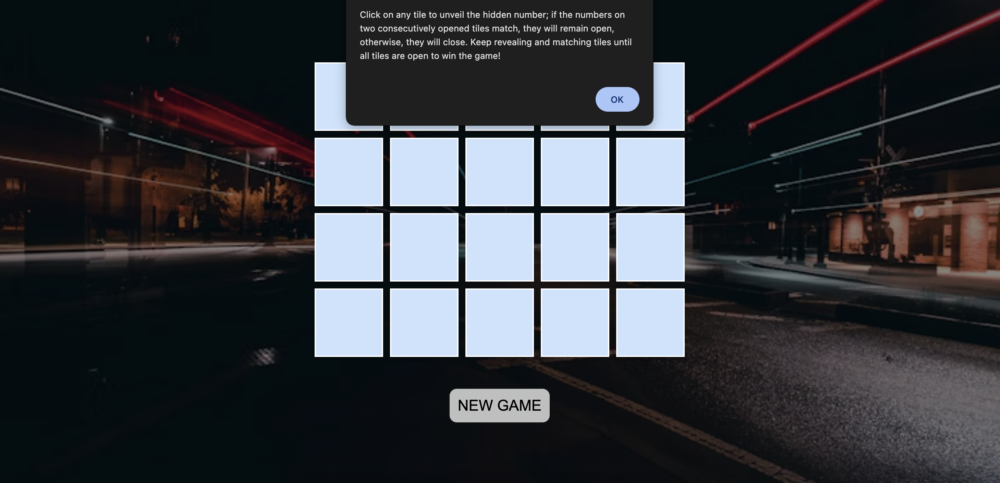
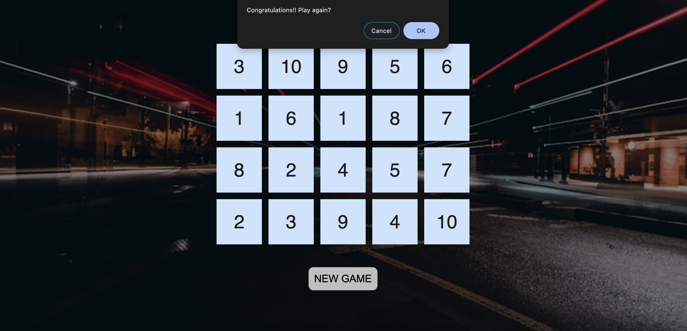

# Memory Game

Try yourself: [Live demo](https://voice2post.netlify.app/)

## Description
With 20 tiles containing 10 pairs of matching numbers, memorize their positions on the first look and then click on the tiles to find and match each pair. You win when you match all 10 pairs.

## Instructions
Click on any tile to unveil the hidden number; if the numbers on two consecutively opened tiles match, they will remain open, otherwise, they will close. Keep revealing and matching tiles until all tiles are open to win the game!

## Learnings
1. Card flip animation:
    - possible transform values - scale, translate, skew, rotate (along both X and Y axes)
    - backface-visibility - when element's front is not facing the screen, it becomes hidden
    - perspective - determines the distance between the z=0 plane and the user, in order to give a 3D-positioned element 3D look
    - transform-style: preserve-3d - sets whether children of an element are positioned in the 3D space or are flattened in the plane of the element.
2. JS synchronous methods:
    - alert - only acknowledgement required
    - confirm - accept/deny acknowledgement possible
    - prompt - user can give input

## Snapshots

1. Instructions screen

2. Final screen

